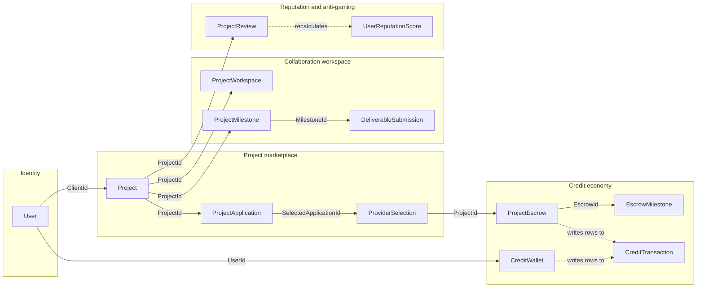

# Architecture

SkillLedger was a professional skills-barter marketplace: users posted projects, applied to each other's
projects, and settled in an internal credit currency instead of money. A .NET 9 Web API served a Next.js
frontend, running at `skillledger.app` on Neon Postgres with Stripe in live mode. It is shut down.

This describes the layering as it is in the tree, not as the repo describes it. Related:
[CREDIT-LEDGER.md](./CREDIT-LEDGER.md), [ENGINEERING-LOG.md](./ENGINEERING-LOG.md),
[TESTING.md](./TESTING.md), [METRICS.md](./METRICS.md), [DOMAIN.md](./DOMAIN.md), [README](../README.md).

Counts below come from `git ls-files` against this snapshot, which lists tracked files only and so cannot
pick up build output. The snapshot carries a single squashed commit, so nothing here is measured from the
original 944-commit history.

---

## The projects

[`SkillLedger.sln`](../SkillLedger.sln) lists four projects. A fifth,
[`Tools/DatabaseSeeder`](../tests/SkillLedger.Tests/Tools/DatabaseSeeder/DatabaseSeeder.csproj), has its own
`.csproj` but sits in neither the solution nor the test project's compile set: nothing builds it.

| Project | Contents |
|---|---|
| `src/SkillLedger.Api` | 36 controller files (one is `BaseApiController.cs`, so 35 endpoint controllers), 4 middleware, 3 SignalR hubs, `Program.cs` |
| `src/SkillLedger.Core` | 62 entity files, 52 interfaces, 27 DTO files, 30 enums, 5 validation attributes, 4 validators |
| `src/SkillLedger.Infrastructure` | 70 `.cs` under `Services/` (66 services plus 4 test-data factories), 58 EF entity configurations, 1 `DbContext`, 3 migrations, 2 authorization classes |
| `tests/SkillLedger.Tests` | 217 `.cs` files |
| `tests/SkillLedger.Tests/Tools/DatabaseSeeder` | Console app, 4 files, not built by the solution |

A `CheckoutController.cs.disabled` sits next to the live `CheckoutController.cs`, and `TestController.cs` is
stripped from Release builds by an MSBuild condition in
[SkillLedger.Api.csproj](../src/SkillLedger.Api/SkillLedger.Api.csproj).

Project references point the conventional way: `Api` → `Core` + `Infrastructure`; `Infrastructure` → `Core`;
`Core` → nothing; `Tests` → all three. The direction is right. The package references are where it stops being
a domain layer.

---

## Where the layering leaks

### Core depends on ASP.NET Identity

[SkillLedger.Core.csproj](../src/SkillLedger.Core/SkillLedger.Core.csproj) references
`Microsoft.AspNetCore.Identity.EntityFrameworkCore` and `Microsoft.AspNetCore.Authorization`. That is not
incidental: two entities inherit Identity base types:

- [`User : IdentityUser<Guid>`](../src/SkillLedger.Core/Entities/User.cs#L7)
- [`Role : IdentityRole<Guid>`](../src/SkillLedger.Core/Entities/Role.cs#L6)

`User` therefore inherits `PasswordHash`, `SecurityStamp`, `TwoFactorEnabled`, `LockoutEnd` and the rest of
the Identity surface. The domain root and the auth framework's storage type are one type; changing auth stacks
means rewriting the domain. The Identity package also pulls EF Core into `Core` transitively: no file under
`src/SkillLedger.Core/` has a `using Microsoft.EntityFrameworkCore`, so the leak is at the package boundary,
not the source boundary.

### Persistence and validation attributes live on the entities

All 62 entity files import `System.ComponentModel.DataAnnotations`. Across the folder: 202 `[MaxLength]`, 96
`[Required]`, 24 `[StringLength]`, 5 `[NotMapped]`, 3 `[Timestamp]`, 2 `[Key]`.

`[MaxLength]` and `[Required]` are read by EF Core for column shape *and* by MVC for request validation, so
one attribute serves two frameworks. `[Timestamp]` is EF-only (a concurrency token) and appears on
[`CreditWallet.RowVersion`](../src/SkillLedger.Core/Entities/CreditWallet.cs#L82), `CreditTransfer` and
`UserCreditReport`. Meanwhile 58 `IEntityTypeConfiguration<T>` classes under
[`Configurations/`](../src/SkillLedger.Infrastructure/Configurations) map the same entities fluently. Column
constraints are specified in two places.

### Entities carry crypto that needs a key handed in

`CreditTransaction` exposes two methods that each take a secret key as a parameter:
[CalculateHash](../src/SkillLedger.Core/Entities/CreditTransaction.cs#L211) and
[VerifyHash](../src/SkillLedger.Core/Entities/CreditTransaction.cs#L224), computing HMAC-SHA256 over the
transaction's fields plus `PreviousTransactionHash`. The entity owns the algorithm; the caller owns the key.
All eight call sites are in
[CreditWalletService](../src/SkillLedger.Infrastructure/Services/CreditWalletService.cs#L374): eight calls to
`CalculateHash`, one to `VerifyHash`. Nothing stops you persisting a `CreditTransaction` with an empty
`TransactionHash`; the invariant is enforced by convention in one service.

### `CreditWallet` holds mapped and unmapped copies of the same numbers

Balances are encrypted at rest as strings: `EncryptedBalance`, `EncryptedPendingBalance`,
`EncryptedTotalEarned`, `EncryptedTotalSpent`, each `[Required] [MaxLength(512)]`. Next to each sits an
`[NotMapped]` plaintext `int`. The comment at
[CreditWallet.cs:111](../src/SkillLedger.Core/Entities/CreditWallet.cs#L111) explains: "Non-mapped properties
for decrypted values (populated by service layer)", and at
[CreditWallet.cs:115](../src/SkillLedger.Core/Entities/CreditWallet.cs#L115), "Not stored in database -
populated by CreditWalletService".

So `wallet.Balance` is `0` on any wallet a service forgot to decrypt, with no type-level signal telling you
which state you hold, and [AvailableBalance](../src/SkillLedger.Core/Entities/CreditWallet.cs#L142) silently
returns `0` with it. A neighbouring comment at
[CreditWallet.cs:108](../src/SkillLedger.Core/Entities/CreditWallet.cs#L108) records that transaction
navigation properties were dropped entirely: "accessed via service layer queries due to nullable foreign key
complexity in EF Core". [CREDIT-LEDGER.md](./CREDIT-LEDGER.md) covers the cost at query time.

---

## `Program.cs` is the composition root, and it is 1,037 lines

There is no `AddInfrastructure()` or `AddApplication()` extension method anywhere in `src/`. Every dependency
is registered inline in [Program.cs](../src/SkillLedger.Api/Program.cs), across 93 `builder.Services.Add*`
calls: 59 `AddScoped`, 8 `AddSingleton`, 3 `AddDbContext`, 3 `AddHttpClient`, 3 `AddDistributedMemoryCache`, 1
`AddTransient`, and 16 framework registrations (`AddControllers`, `AddIdentity`, `AddSignalR`, `AddCors`, and
so on). The conditional ones are where the design shows.

**Three `AddDbContext` branches.** [Line 136](../src/SkillLedger.Api/Program.cs#L136) checks
`IsEnvironment("Testing")` and registers InMemory with a `Guid.NewGuid()`-suffixed database name per run.
Otherwise [line 145](../src/SkillLedger.Api/Program.cs#L145) reads the `Database:UseSqlite` flag: true gives
[SQLite](../src/SkillLedger.Api/Program.cs#L150), false gives
[Npgsql](../src/SkillLedger.Api/Program.cs#L184). The Postgres branch parses both `postgresql://` URI and
ADO.NET forms, forces `SslMode.Require`, and sets `MinPoolSize = 0` with `ConnectionIdleLifetime = 30` under a
comment naming Neon serverless. Provider selection is an environment name plus a config boolean, and all three
providers ship.

**`AddIdentity<User, Role>`** at [line 204](../src/SkillLedger.Api/Program.cs#L204): 12-character minimum
password requiring all four character classes, 5 failed attempts then a 30-minute lockout, unique email
required, `RequireConfirmedEmail = false`.

**Redis registers `null!` when absent.** [Line 600](../src/SkillLedger.Api/Program.cs#L600) registers
`IConnectionMultiplexer` from `ConnectionMultiplexer.Connect(...)`, but the factory catches connect failures
and [returns `null!`](../src/SkillLedger.Api/Program.cs#L610). Three further branches,
[outer catch](../src/SkillLedger.Api/Program.cs#L642),
[caching disabled](../src/SkillLedger.Api/Program.cs#L653) and
[Testing](../src/SkillLedger.Api/Program.cs#L663), register `sp => null!` directly. The comment calls it a
signal: "Register a null IConnectionMultiplexer to signal Redis is unavailable." Anything resolving that
interface gets a non-nullable reference holding null, and must check.

**Environment-switched service pairs**, both keyed off configuration rather than environment name:

- No `Resend:ApiKey` → [`MockEmailService`](../src/SkillLedger.Api/Program.cs#L353) with a `Log.Warning`;
  otherwise [`ResendEmailService`](../src/SkillLedger.Api/Program.cs#L363).
- No `ContentModeration:ApiKey` → [`MockContentModerationService`](../src/SkillLedger.Api/Program.cs#L398);
  otherwise [`ContentModerationService`](../src/SkillLedger.Api/Program.cs#L405) against Azure Content Safety.

A missing key means email silently no-ops and moderation passes everything, differing only by a startup log
line.

`Program.cs` also retains debugging commentary: [line 199](../src/SkillLedger.Api/Program.cs#L199) still
reads "BUG-042 ISOLATION TEST RESULT: Removing Identity did NOT fix the hang!"

---

## Data model

[`SkillLedgerDbContext`](../src/SkillLedger.Infrastructure/Data/SkillLedgerDbContext.cs#L9) is 240 lines,
derives from `IdentityDbContext<User, Role, Guid>`, and declares 64 `DbSet<>` properties against 62 entity
files. The difference reconciles exactly:

- The 62 files declare 69 entity classes. Three files hold several:
  [`AntiGaming.cs`](../src/SkillLedger.Core/Entities/AntiGaming.cs) (5),
  [`ContentModeration.cs`](../src/SkillLedger.Core/Entities/ContentModeration.cs) (3), `DeviceFingerprint.cs`
  (2).
- `User` and `Role` have no explicit `DbSet`; `IdentityDbContext` supplies them, remapped to `Users` /
  `Roles` at
  [SkillLedgerDbContext.cs:232](../src/SkillLedger.Infrastructure/Data/SkillLedgerDbContext.cs#L232).
- Three classes are unmapped: `ExportTemplate`, a plain object used by `FinancialExportService` and never
  persisted; and `UserReputationScores` / `CategoryReputationScores`, near-duplicate leftovers of the mapped
  singular types. The confusingly named
  [UserReputationScoresConfiguration](../src/SkillLedger.Infrastructure/Configurations/UserReputationScoresConfiguration.cs#L7)
  configures the *singular* type; the plural class is dead and still has tests.

69 − 2 − 3 = 64.

The entities form five domains:

| Domain | Entities |
|---|---|
| Identity, profile, skills | `User`, `Role`, `Permission`, `RolePermission`, `Profile`, `Skill`, `UserSkill`, `Experience`, `ExperienceSkill`, `SkillEndorsement`, `VerificationRequest`, `PasswordReset`, `AuditLog`, `PrivacyRequest` |
| Project marketplace | `Project`, `ProjectSkill`, `ProjectDeliverable`, `ProjectApplication`, `ProjectApplicationAttachment`, `ProviderSelection`, `SavedSearch`, and the application questionnaire set (`Questionnaire`, `QuestionnaireQuestion`, `QuestionOption`, `QuestionnaireResponse`, `QuestionResponse`) |
| Credit economy | `CreditWallet`, `CreditTransaction`, `CreditTransfer`, `UserCreditReport`, `ProjectEscrow`, `EscrowMilestone`, plus the Stripe side: `SubscriptionTier`, `UserSubscription`, `PaymentMethod`, `SubscriptionTransaction`, `ProcessedStripeWebhookEvent` |
| Collaboration workspace | `ProjectWorkspace`, `WorkspaceMessage`, `MessageReaction`, `TypingIndicator`, `WorkspaceDocument`, `DocumentFolder`, `DocumentAccess`, `DocumentShare`, `UploadedFile`, `ProjectMilestone`, `DeliverableSubmission` |
| Reputation and anti-gaming | `ProjectReview`, `UserReputationScore`, `CategoryReputationScore`, `ReputationHistory`, `UserBadge`, `BadgeDefinition`, `BadgeCriteria`, `BadgeEarningHistory`; `AntiGamingAlert`, `UserBehaviorMetric`, `UserNetworkConnection`, `UserSanction`, `GamingRiskAssessment`, `DeviceFingerprint`, `IpGeolocation`; `ContentModerationLog`, `CustomBlocklistTerm`, `ContentReviewQueue` |

The table above is complete but flat; it does not show which entity points at which. This is the
foreign-key path a single project actually walks, one representative chain per domain rather than
all 69 nodes:



Solid arrows are a foreign key named on the diagram; dotted arrows are a service writing a row
into another table rather than a schema constraint. `CreditTransaction` has no FK back to
`ProjectEscrow`: it is nullable-endpoint, chained-by-hash, and described in full in
[CREDIT-LEDGER.md](./CREDIT-LEDGER.md). Note the two milestone entities are unrelated tables that
happen to share a name: `EscrowMilestone` gates a credit release, `ProjectMilestone` is what a
deliverable is submitted against, and neither has a foreign key to the other. For the other 55
entities and every column, the migration below is the source of truth, not this diagram.

---

## Three migrations for a 70-table schema

[`Migrations/`](../src/SkillLedger.Infrastructure/Migrations) holds exactly three:

| Migration | Lines | What it does |
|---|---|---|
| `20260217200308_InitialPostgresCreate` | 4,567 | 70 `CreateTable` calls: the entire schema |
| `20260525000000_AddProcessedStripeWebhookEvents` | 40 | One table |
| `20260525001000_AddPrivacyRequests` | 57 | One table |

The project moved from SQL Server to PostgreSQL in February 2026 and collapsed the prior history into
`InitialPostgresCreate`. Everything before that date is unrecoverable from this tree. If you want to know when
a column was added or why a constraint has the shape it has, the migration folder cannot tell you.

The move left residue in three places:

1. [`DatabaseFix.cs`](../docs/DatabaseFix.cs) at the repository root uses `Microsoft.Data.SqlClient`, defaults to
   `Server=localhost\SQLEXPRESS01;Database=SkillLedgerDb_Dev`, queries `INFORMATION_SCHEMA.COLUMNS` and issues
   T-SQL `ALTER TABLE`. It belongs to no `.csproj`, so it compiles as part of nothing.
2. [`DatabaseSeeder.csproj`](../tests/SkillLedger.Tests/Tools/DatabaseSeeder/DatabaseSeeder.csproj) still
   references `Microsoft.EntityFrameworkCore.SqlServer` 9.0.0, and its
   [appsettings.json](../tests/SkillLedger.Tests/Tools/DatabaseSeeder/appsettings.json) points at the same
   `localhost\SQLEXPRESS01` instance with `MultipleActiveResultSets=true`.
3. [`CLAUDE.md:53`](../CLAUDE.md#L53) still lists "SQL Server (Docker) | 9030" and "SQL Server (Windows) |
   `localhost\SQLEXPRESS01`" in its port table, and [line 78](../CLAUDE.md#L78) names the database as "SQL
   Server 2022". [`docker-compose.yml`](../docker-compose.yml) starts exactly one service:
   `mcr.microsoft.com/mssql/server:2022-latest`. Local dev and production had drifted onto different engines
   and nobody updated the docs.

The remaining EF providers are deliberate rather than leftovers. `Npgsql.EntityFrameworkCore.PostgreSQL` is in
both `Api` and `Infrastructure`; `Microsoft.EntityFrameworkCore.Sqlite` is in `Infrastructure` and serves the
`Database:UseSqlite` dev branch; `Microsoft.EntityFrameworkCore.InMemory` is in `Api` and `Tests` and serves
the `Testing` branch at [Program.cs:140](../src/SkillLedger.Api/Program.cs#L140). No SQL Server provider is
referenced by any `src/` project, only by the unbuilt seeder.

---

## Auth and authorization

**Cookie authentication only.** [`ConfigureApplicationCookie`](../src/SkillLedger.Api/Program.cs#L235) names
the cookie `.SkillLedger.Auth`, nulls `LoginPath` / `AccessDeniedPath` / `LogoutPath` and replaces the
redirect events with bare 401/403 so the API never redirects to an MVC login page. Expiry is 15 minutes
sliding, and `SecurityStampValidatorOptions.ValidationInterval` is `TimeSpan.Zero`, so the stamp is
revalidated on every request. In production the cookie is `SameSite=None; Secure` with
[Domain = ".skillledger.app"](../src/SkillLedger.Api/Program.cs#L272) so `skillledger.app` and
`api.skillledger.app` share it; antiforgery repeats the trick at
[line 316](../src/SkillLedger.Api/Program.cs#L316) with header `X-CSRF-TOKEN`, applied globally.

JWT bearer auth was removed, though `Microsoft.AspNetCore.Authentication.JwtBearer` is still referenced by
`Api` and `Infrastructure`.
[OptimizedProjectSearchTests.cs:133](../tests/SkillLedger.Tests/Integration/OptimizedProjectSearchTests.cs#L133)
skips a test with the reason `"Obsolete - JWT Bearer token authentication removed in favor of cookie
authentication"`. The stale model survives elsewhere:
[SubscriptionMiddleware.cs:37](../src/SkillLedger.Api/Middleware/SubscriptionMiddleware.cs#L37) still says
"Extract user ID from JWT token", and [CLAUDE.md:79](../CLAUDE.md#L79) still lists the auth stack as "ASP.NET
Identity, JWT Bearer".

**Permission policies resolve dynamically.**
[`PermissionPolicyProvider`](../src/SkillLedger.Infrastructure/Authorization/PermissionPolicyProvider.cs#L9),
registered as the `IAuthorizationPolicyProvider` at [Program.cs:571](../src/SkillLedger.Api/Program.cs#L571),
parses policy names at request time (`RequirePermission:{permission}`, or
`RequirePermissions:{AND|OR}:{p1,p2,...}` for several), falling back to `DefaultAuthorizationPolicyProvider`
otherwise.
[`PermissionAuthorizationHandler`](../src/SkillLedger.Infrastructure/Authorization/PermissionAuthorizationHandler.cs)
resolves them against the `Permission` / `Role` / `RolePermission` tables.
[`RequirePermissionAttribute`](../src/SkillLedger.Core/Attributes/RequirePermissionAttribute.cs) is the
call-site sugar, and its living in `Core` is why `Core` references `Microsoft.AspNetCore.Authorization`.

**Subscription gating runs twice.** [`AddAuthorization`](../src/SkillLedger.Api/Program.cs#L498) registers
named policies (`ActiveSubscription`, `BusinessOrHigher`, `EnterpriseTier`, `ApiAccess`, `AdvancedAnalytics`,
`MultiSignature`, and others) backed by
[`SubscriptionAuthorizationService`](../src/SkillLedger.Infrastructure/Services/SubscriptionAuthorizationService.cs)
as an `IAuthorizationHandler` ([Program.cs:575](../src/SkillLedger.Api/Program.cs#L575)). Separately,
[`SubscriptionMiddleware`](../src/SkillLedger.Api/Middleware/SubscriptionMiddleware.cs) sits between
`UseAuthentication` and `UseAuthorization` ([Program.cs:889](../src/SkillLedger.Api/Program.cs#L889)) and
enforces tier access again by path. Two mechanisms for one rule, one of which runs before authorization has
produced a result.

Pipeline order ([Program.cs:818-895](../src/SkillLedger.Api/Program.cs#L818)): correlation ID → Sentry →
Serilog → forwarded headers → HSTS/HTTPS → CORS → request timeout → rate limiting → authentication →
subscription middleware → authorization → controllers and three SignalR hubs.

---

## The frontend

[`web/`](../web) is a Next.js App Router app, 605 tracked files, 483 under `web/src/`. It is two products in
one tree.

**The signed-in product:** `dashboard`, `marketplace`, `projects/[id]`, `projects/[id]/applications`,
`applications`, `create-project`, `my-projects`, `wallet`, `workspace/[id]`, `messages/[workspaceId]`,
`profile`, `reputation`, `subscription`, plus auth routes.

**A programmatic-SEO marketing site:** `glossary/[term]`, `industries/[slug]`, `locations/[city]/[skill]`,
`compare/[slug]`, `how-to/[slug]`, `features/[slug]`, `categories/[slug]`, `resources/[slug]`,
`skill-exchange/[city]`, `trade/[skillA]/for/[skillB]` and `tools/barter-valuation-calculator`, fed by 52 MDX
files under [`web/content/`](../web/content) plus generator data in `web/src/lib/data/`.
[`web/FOUND_BUGS.md:159`](../web/FOUND_BUGS.md#L159) records a sitemap of 1,286 URLs. What that surface
claimed, versus what the backend implemented, is [DOMAIN.md](./DOMAIN.md).

**How it talked to the API:** not through a generated client. `web/next.config.js` declares a rewrite proxying
everything under `/api/` to the .NET service:

```js
source: '/api/:path((?!auth).*)*',
destination: `${backendUrl}/api/:path*`,
```

`backendUrl` comes from `NEXT_PUBLIC_API_URL`, defaulting to `http://localhost:8030`. Auth paths are excluded
by the negative lookahead and handled by an authored route handler at
[`api/auth/[...path]/route.ts`](../web/src/app/api/auth/%5B...path%5D/route.ts), which forwards `Set-Cookie`
headers explicitly and throws at startup if `NEXT_PUBLIC_API_URL` is unset in production. Components then
`fetch('/api/...')` same-origin, which is what makes the cross-subdomain cookie setup work.

---

## Deployment

Three targets, all still in the tree, in the order they were tried.

**Azure: configured and abandoned.**
[`azure-deployment/azure-app-service.json`](../azure-deployment/azure-app-service.json) is an ARM template
defaulting to a P2v3 App Service Plan with Key Vault parameters.
[`docs/DEPLOYMENT_GUIDE.md`](../docs/DEPLOYMENT_GUIDE.md) prescribes App Service, **Azure SQL Database (S3 or
higher)**, Container Registry, Application Insights and Static Web Apps. None of it shipped, and the guide now
describes an architecture the code cannot run on: the SQL Server provider is gone from `src/`.

**Railway: the backend.** [`railway.toml`](../railway.toml) is 8 lines: dockerfile builder, `/health`
healthcheck with a 60-second timeout, restart on failure up to 3 times. It names no project, no service, and
no domain, so the file alone does not tell you where it deployed.

**Cloudflare Workers: the frontend.** [`web/wrangler.jsonc`](../web/wrangler.jsonc) deploys
`.open-next/worker.js` (OpenNext's Workers adapter) with `nodejs_compat`, `workers_dev: false`, `preview_urls:
false`, observability at 100% head sampling, and two custom-domain routes: `skillledger.app` and
`www.skillledger.app`.

**Local.** [`Dockerfile`](../Dockerfile) is a multi-stage Alpine build onto `aspnet:9.0-alpine`, non-root
user, port 8080, `curl` healthcheck. It still installs ICU under the comment "required for SQL Server culture
support", and [`docker-compose.yml`](../docker-compose.yml) brings up SQL Server 2022 and nothing else.

**There is no CI.** The tree has no `.github/` directory at all: no workflow, no build check, no test gate.
All 217 test files ran only when someone ran them locally.

---

## What I would do differently

- Add a `.github/workflows/` build-and-test job on day one. A test suite with no CI is a suite that passes
  until it doesn't and nobody is watching. This is the largest single gap in the tree.
- Keep `Core` free of package references. `User : IdentityUser<Guid>` welded the domain root to the auth
  framework. A separate `ApplicationUser` storage type linked by `UserId` would have cost one join and kept
  the auth stack swappable.
- Split `Program.cs` into `AddPersistence` / `AddIdentityAndAuth` / `AddDomainServices` / `AddIntegrations`.
  93 inline registrations in one file means no DI change can be reviewed in isolation, and four branches
  returning `null!` are what happens when nobody can see the whole picture.
- Never register `null!` for a non-nullable interface. Use `IConnectionMultiplexer?`, a no-op implementation
  or a hard startup failure: "null as a signal" converts a wiring error into a runtime NRE somewhere else.
- Pick one mapping mechanism. 322 length and required annotations plus 58 fluent configuration classes gives
  two sources of truth for the same columns, with no tooling to flag disagreement.
- Delete on discovery. `CheckoutController.cs.disabled`, `DatabaseFix.cs`, the duplicate reputation-score
  classes, the SQL Server seeder and the BUG-042 comments all survived to the final commit.
- Update docs in the same commit as the migration. `CLAUDE.md`, `DEPLOYMENT_GUIDE.md` and `docker-compose.yml`
  describe a SQL Server / Azure system that stopped existing in February 2026. A new contributor following the
  deployment guide would have built the wrong thing.
- Don't squash migration history during an engine port. The Postgres cutover was the right call; collapsing
  everything before it into one 4,567-line `InitialPostgresCreate` discarded the record of why the schema
  looks the way it does.
