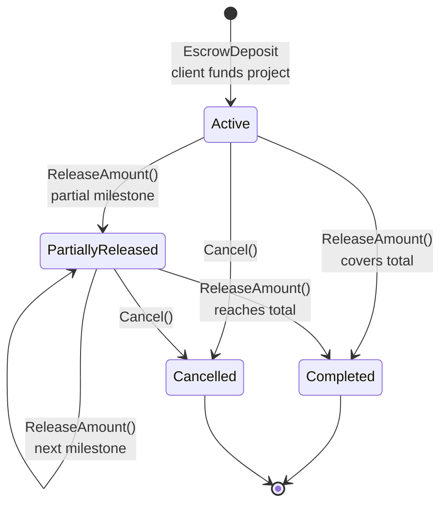
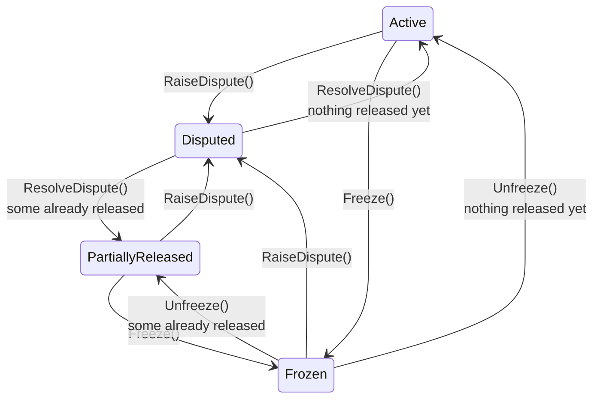

# The credit ledger

SkillLedger's currency was an integer count of "collaboration credits". You got 100 when you
verified your account, you spent them to have work done for you, and you earned them by doing work
for someone else. No credit was ever redeemable for money. There was no float, no custody, no
regulator, and, since the product never opened to the public, no balance that belonged to anyone
but a test account.

It was still built like a bank.

Wallet balances are AES-256-GCM ciphertext in the database. Every movement of credit is written to
an append-only transaction log, where each row carries an HMAC-SHA256 signature that is meant to
cover its own fields and the signature of the row before it. Every mutation opens a database transaction at
`IsolationLevel.Serializable`. There is a column on the wallet table whose only purpose is to
identify which encryption key generation encrypted that row, so keys could be rotated.

This document is about that decision: what it bought, what it cost, and the three places where the
mechanism turns out to be theatre. The last of those is the reason this page exists:
the production configuration missed the flag that switches the encryption on, so the live database was
encrypted with a key that is printed in this repository.

→ Defects in narrative form are in [ENGINEERING-LOG.md](./ENGINEERING-LOG.md). The layering this
sits inside is in [ARCHITECTURE.md](./ARCHITECTURE.md).

---

## The shape of it

Four types collaborate.

**[`CreditWallet`](../src/SkillLedger.Core/Entities/CreditWallet.cs)**, one per user. It has no
`Balance` column. It has `EncryptedBalance`, `EncryptedPendingBalance`, `EncryptedTotalEarned` and
`EncryptedTotalSpent`, each `MaxLength(512)` to leave room for base64 expansion, plus a
`[Timestamp] RowVersion` for optimistic concurrency and a `KeyIdentifier`. The plaintext `Balance`,
`PendingBalance`, `TotalEarned` and `TotalSpent` properties exist but are `[NotMapped]`. The
service layer fills them in after decrypting, and they never touch the database.

**[`CreditTransaction`](../src/SkillLedger.Core/Entities/CreditTransaction.cs)**, the log. Nullable
`FromUserId` and `ToUserId` so the system can mint (`StartingCredit`) and burn (`PlatformFee`,
`Penalty`) against nobody. `Amount` is a plaintext `int` constrained to be positive; direction is
carried by the endpoints and by a 13-member
[`CreditTransactionType`](../src/SkillLedger.Core/Enums/CreditTransactionType.cs) enum rather than
by sign. `TransactionHash` and `PreviousTransactionHash` are the columns the hash chain is built
from: see [The hash chain](#the-hash-chain) below for how much of the log actually chains.

**[`ProjectEscrow`](../src/SkillLedger.Core/Entities/ProjectEscrow.cs)** holds credit between
agreement and delivery. `TotalAmount` and `ReleasedAmount` are plaintext integers;
`RemainingAmount` and `IsFullyReleased` are computed properties. Milestones release it in slices.

**[`EncryptionService`](../src/SkillLedger.Infrastructure/Services/EncryptionService.cs)**: AES-256-GCM,
12-byte random nonce, 16-byte tag, all three parts concatenated and base64'd.

The asymmetry between the second and the first is the design's whole personality. Transaction
amounts are readable by the database. Wallet balances are not.

### The escrow lifecycle

`ProjectEscrow.Status` is a six-value
[`EscrowStatus`](../src/SkillLedger.Core/Enums/EscrowStatus.cs) enum, and every transition is a
method on the entity itself
([ProjectEscrow.cs:185-260](../src/SkillLedger.Core/Entities/ProjectEscrow.cs#L185)) rather than
scattered `if` blocks in a service:

Two diagrams, not one. `Active` and `PartiallyReleased` are the hub of every edge in this machine,
and drawing all seven of their outbound transitions on one graph put `ReleaseAmount()`, `Cancel()`,
`Freeze()` and `RaiseDispute()` labels close enough to merge into an unreadable string. Splitting
by concern (money moving forward versus the account being paused or contested) puts them on two
graphs neither of which asks more than four labels to share a node.

**Funding, release, and cancellation:**



**Disputes and freezes**, both of which pause the diagram above and hand control back to it.
`Active` and `PartiallyReleased` here are the same two states, not copies:



Every arrow above is a real call site, not an inferred state; `CanBeReleased` gates the four
`ReleaseAmount()` edges in the first diagram to `Active` and `PartiallyReleased` only
([ProjectEscrow.cs:171](../src/SkillLedger.Core/Entities/ProjectEscrow.cs#L171)), and `Frozen` and
`Disputed` both resume to `PartiallyReleased` rather than `Active` once anything has already been
released, which is why those two edges carry a `ReleasedAmount` guard instead of being
unconditional. The `Frozen --> Disputed` edge is easy to miss on a single read: `RaiseDisputeAsync`
only rejects the call when `escrow.IsTerminal` is true: `Completed` or `Cancelled`
([ProjectEscrowService.cs:581](../src/SkillLedger.Infrastructure/Services/ProjectEscrowService.cs#L581)).
So a frozen escrow, which is neither, can still be disputed by a participant.
Every one of these transitions is written from inside a `Serializable` transaction
(`ProjectEscrowService`, four of the fourteen `BUG-HIGH-010` sites, see
[ENGINEERING-LOG.md](./ENGINEERING-LOG.md#1-the-escrow-race-fix-was-compiled-out-of-every-test-that-covered-it)),
and each `EscrowRelease` or `EscrowRefund` writes a row through the same
[`CreditTransaction`](../src/SkillLedger.Core/Entities/CreditTransaction.cs) log described above:
the state machine and the ledger are two views of one write.

---

## What encrypting the balance actually costs

A balance you cannot read in SQL is a balance you cannot sum, filter, index, range-query, or check
a constraint against.

Every one of those operations moves into application memory, and each one costs a decrypt.
`GetWalletBalanceAsync` loads the row and calls `DecryptAsync`
([CreditWalletService.cs:153](../src/SkillLedger.Infrastructure/Services/CreditWalletService.cs#L153)).
A transfer loads two wallets and decrypts eight fields before it can compare a balance to an amount
([CreditWalletService.cs:329-331](../src/SkillLedger.Infrastructure/Services/CreditWalletService.cs#L329)),
then re-encrypts eight to write them back. `DecryptAsync` is `async` because it awaits a key
lookup, so the arithmetic on a two-party transfer is sixteen awaited crypto operations around what
would otherwise be one `UPDATE ... SET balance = balance - @amount WHERE balance >= @amount`.

The consequences show up as a fork in the code. Anything the reporting layer can compute from
transaction rows, it computes in SQL.
[`SumAsync(t => t.Amount)`](../src/SkillLedger.Infrastructure/Services/CreditWalletService.cs#L1460)
runs on the database. Anything that needs a balance has to be reconstructed from the log instead,
because the authoritative number is opaque. `FinancialReportingService` and its 807-line `.Helpers`
partial are almost entirely queries over `CreditTransaction`, not over `CreditWallet`, for exactly
this reason.

There is also no database-level guarantee that a balance is non-negative. The `Amount > 0` check
constraint on the transaction table is enforceable; `balance >= 0` is not, because the database
cannot see the balance. Overdraft protection lives entirely in C#, inside a `Serializable`
transaction, and that is the only thing standing behind it.

**Was it worth it?** For an internal points system with no cash value, no. The threat model that
justifies column-level encryption of a financial figure, an attacker with read access to database
files or backups who must not learn balances, is not a threat model this product had, and the
design paid for it in every read path. The interesting part is not that the tradeoff was made. It
is that once the tradeoff was made, it propagated: the reporting layer's shape, the absence of
balance constraints, and the reliance on `Serializable` are all downstream of one column type
decision.

---

## The hash chain

[`CreditTransaction.CalculateHash`](../src/SkillLedger.Core/Entities/CreditTransaction.cs#L211)
builds a string from the row's identity, endpoints, amount, type, project, description, timestamp
and the previous row's hash, then HMAC-SHA256s it:

```text
{Id}:{FromUserId}:{ToUserId}:{Amount}:{Type}:{ProjectId}:{Description}:{CreatedAt:O}:{PreviousTransactionHash}
```

Chaining each row to its predecessor is what turns per-row signatures into something worth having:
edit one historical row and every row after it becomes invalid, rather than just that one. The
construction is right.

It is wired up once. `CreditWalletService` calls `CalculateHash(hashKey)` at eight sites, and
`PreviousTransactionHash` is assigned at exactly one of them,
[line 370](../src/SkillLedger.Infrastructure/Services/CreditWalletService.cs#L370), on the transfer
path. Starting credits, escrow deposits, escrow releases and escrow refunds are signed with a null
predecessor. Seven of the eight sites therefore write an independent signature and no chain, so
deleting one of those rows outright leaves nothing inconsistent behind.

And the key is a constant.

```csharp
private Task<byte[]> GetTransactionHashKeyAsync()
{
    // In a real implementation, this would get a dedicated HMAC key from Azure Key Vault
    // For testing/development, use a fixed key derived from a known string
    const string fixedSeed = "SkillLedger-TransactionHash-Key-2024";
    return Task.FromResult(System.Text.Encoding.UTF8.GetBytes(fixedSeed));
}
```

Source: [CreditWalletService.cs:1798](../src/SkillLedger.Infrastructure/Services/CreditWalletService.cs#L1798)

The comment is honest about it, which is more than most placeholders manage. But an HMAC whose key
is a `const string` in the assembly is a checksum.

So the row signatures detect a corrupted write or a hand-edited row. They detect nothing from
anyone who has the binary, and every party who could plausibly tamper with this table also had the
binary. And the chain that would have made a deletion detectable is formed on one code path out of
eight.

---

## The key rotation that was designed and never written

`CreditWallet` carries a `KeyIdentifier` column, `MaxLength(128)`, documented in the entity as
"Used for key rotation and cryptographic operations". `GenerateKeyIdentifierAsync` stamps each
wallet with `wallet-key-{yyyyMMdd}-{guid}` truncated to 32 characters. The schema is ready.

```csharp
public async Task<bool> RotateEncryptionKeysAsync()
{
    // This would be a complex operation involving:
    // 1. Generate new key in Azure Key Vault
    // 2. Re-encrypt all wallet data with new key
    // 3. Update key identifiers
    // 4. Verify integrity

    // For now, return true as placeholder
    _logger.LogInformation("Encryption key rotation requested - not yet implemented");
    return await Task.FromResult(true);
}
```

Source: [CreditWalletService.cs:1563](../src/SkillLedger.Infrastructure/Services/CreditWalletService.cs#L1563)

Returning `true` is the part that matters. A stub that threw `NotImplementedException` would fail
a rotation drill loudly. This one reports success. Any caller, whether an operator runbook, a
scheduled job or a compliance checkbox, is told the keys were rotated.

Its neighbour has the same shape.
[`VerifyEncryptionIntegrityAsync`](../src/SkillLedger.Infrastructure/Services/CreditWalletService.cs#L1576)
returns `true` if the four fields decrypt without throwing. It does not verify the transaction
chain, does not recompute the balance from the log, and does not compare the decrypted balance
against anything. It answers "is this row decryptable", under the name "is this row intact".

---

## The flag that was never read

This is the one that would have mattered if the product had reached real users.

The encryption key comes from
[`AzureKeyVaultService.GetDataEncryptionKeyAsync`](../src/SkillLedger.Infrastructure/Services/AzureKeyVaultService.cs#L68).
Its first branch:

```csharp
if (!_config.Enabled || _keyClient == null)
{
    // Generate a deterministic key for development/testing to ensure consistency across operations
    var tempKey = new byte[32];
    var seedString = "SkillLedger-Test-DEK-Seed-For-Consistent-Encryption";
    ...
}
```

The development key is `SHA256` of a string in this repository. That is correct and normal. Tests
need a stable key, and the branch is guarded by `_config.Enabled`.

`_config` is
[`AzureKeyVaultConfiguration`](../src/SkillLedger.Infrastructure/Configuration/AzureKeyVaultConfiguration.cs).
It has an `Enabled` property, defaulting to `false`. It does not have a `UseKeyVault` property.

[`appsettings.json:58-62`](../src/SkillLedger.Api/appsettings.json#L58) sets both:

```json
"AzureKeyVault": {
  "VaultUri": "...",
  "Enabled": false,
  "UseKeyVault": false
}
```

[`appsettings.Production.json:75-77`](../src/SkillLedger.Api/appsettings.Production.json#L75) sets
one:

```json
"AzureKeyVault": {
  "UseKeyVault": true
}
```

`UseKeyVault` appears in three configuration files and in no C# file anywhere in `src/` or
`tests/`. ASP.NET Core layers `appsettings.Production.json` over `appsettings.json`, so in
production `Enabled` remained `false`, `VaultUri` remained unset, the constructor logged "Azure Key
Vault is disabled or not configured", and every wallet balance in the live Neon database was
encrypted under the published test key.

It goes one layer deeper than a misnamed flag. `IOptions<AzureKeyVaultConfiguration>` is never
bound to any configuration section anywhere in `Program.cs`: there is no
`Configure<AzureKeyVaultConfiguration>(...)` call in the tree, only a `Configure<AzureKeyVaultSettings>`
call for an unrelated, near-identically-named class. So `_config.Enabled` is not "false because
production didn't override it"; it is false because nothing ever wires this class to configuration
at all, in any environment, including a hypothetical one where `AzureKeyVault.Enabled` had been set
correctly. A separate
[`"AzureKeyVaultConfiguration": { "Enabled": true }`](../src/SkillLedger.Api/appsettings.Production.json#L20)
block does sit in `appsettings.Production.json`, and it would look, to a reader skimming the JSON,
like the fix. It is not, because no code binds `IOptions<AzureKeyVaultConfiguration>` to a section
by that name either. The flag was never read because nothing was ever plumbed to read it.

The service ran in production. `appsettings.Production.json` also carries
`"Stripe": { "IsEnabled": true, "IsTestMode": false }`, and the frontend deployed to
`skillledger.app` with a live publishable key. Whatever balances existed there were protected by a
constant.

Nothing in `Program.cs` asserts at startup that Key Vault is reachable when the environment is
Production. The system was built to fail open, and the two keys, one for confidentiality and one for
integrity, failed open together.

### The other half of that method

Even the branch that does reach Key Vault does not use it as a key store
([AzureKeyVaultService.cs:94-103](../src/SkillLedger.Infrastructure/Services/AzureKeyVaultService.cs#L94)):

```csharp
var key = await _keyClient.GetKeyAsync(_encryptionConfig.MasterKeyName);
var cryptoClient = _keyClient.GetCryptographyClient(key.Value.Name, key.Value.Properties.Version);

// For AES keys, we need to derive a key from Key Vault
// This is a simplified approach - in production, use proper key derivation
var keyMaterial = Encoding.UTF8.GetBytes($"{_encryptionConfig.MasterKeyName}-data-{DateTime.UtcNow:yyyy-MM}");
var hashedKey = SHA256.HashData(keyMaterial);
```

The Key Vault key is fetched, a cryptography client is constructed from it, and both are then
discarded. The actual key is `SHA256("<key name>-data-<current year and month>")`, derived from a
configuration string and the calendar. Key Vault is used to prove a key exists, not to supply one.

The `yyyy-MM` is worse than the rest. On the first of every month the derived key changes, and
every balance encrypted before that moment stops decrypting. That is almost certainly what the
legacy-CBC fallback in
[`DecryptAsync`](../src/SkillLedger.Infrastructure/Services/EncryptionService.cs#L75) is for: catch
the `CryptographicException`, log "GCM decryption failed, attempting legacy CBC fallback", and try
an unauthenticated CBC decrypt of the same bytes with the same key. It is described as backward
compatibility for pre-migration data. It is also the only thing between a month boundary and an
unreadable wallet.

---

## What the design got right

The critical account is more balanced than the sections above suggest, and the parts that are
correct were not obvious.

**Serializable isolation on every money path.** Fourteen call sites open
`BeginTransactionAsync(System.Data.IsolationLevel.Serializable)`, each tagged `BUG-HIGH-010 FIX` in
a comment: seven in `CreditWalletService`, four in `ProjectEscrowService`, three in
`CreditTransferService`. The bug they answer is a real one. Two concurrent release requests both
read an escrow, both pass the `CanBeReleased` check, and both release. Read-committed with an
application-level check does not prevent that; Serializable does. Choosing correctness over
throughput on a path that moves value is the right call, and the fix went to every site rather than
the one where the bug was seen. (It is also the fix least exercised by the test suite, for a reason
worth reading: see entry 1 of [ENGINEERING-LOG.md](./ENGINEERING-LOG.md).)

**Direction by type, not by sign.** Amount is always positive and the 13-member type enum carries
meaning. It makes a whole class of sign-error bug unrepresentable, and it makes the log readable.

**Nullable endpoints for system operations.** Minting starting credits and burning platform fees
are recorded as transactions with one null endpoint rather than as a side channel that bypasses the
log. Every credit that ever existed has a row.

**Optimistic concurrency as well as pessimistic.** `[Timestamp] RowVersion` on the wallet is a
second line behind the transaction isolation, and it costs nothing.

**Idempotency on the write paths.** `IIdempotencyService` is registered and used, and
`ProcessedStripeWebhookEvent` exists as a table specifically so a replayed Stripe webhook cannot
double-credit.

---

## The summary a reviewer should take away

The ledger was over-engineered against the wrong threat and under-engineered against the one that
actually applied. Column-level encryption defended a points balance from an attacker with raw
database access, at the cost of every aggregate query in the reporting layer. Meanwhile the two
things that would have made the encryption and the tamper-chain real, a key that is secret and a
configuration that switches it on, were a placeholder and a typo.

None of this is exotic. A constant test key behind an `if (!enabled)` guard is the standard way to
make a crypto-dependent test suite runnable, and a settings key that drifts out of sync with the
class it binds to is the standard way to lose a production flag. Both are ordinary. Putting them
next to a hash-chained append-only ledger is what makes them worth writing down.

→ [ENGINEERING-LOG.md](./ENGINEERING-LOG.md) · [ARCHITECTURE.md](./ARCHITECTURE.md) ·
[TESTING.md](./TESTING.md) · [METRICS.md](./METRICS.md)
